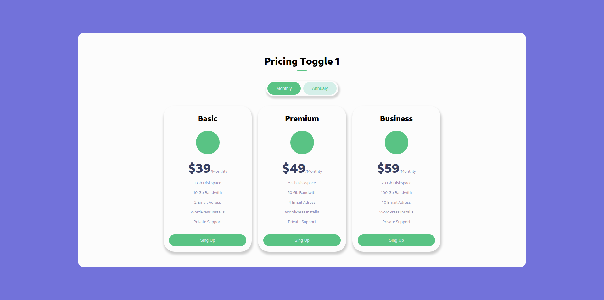
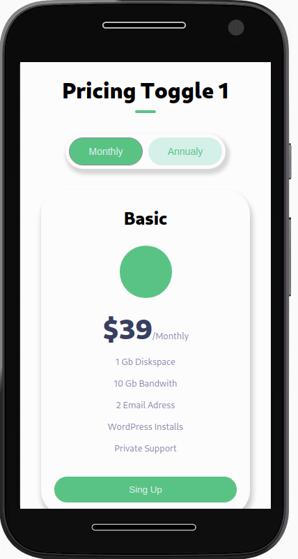
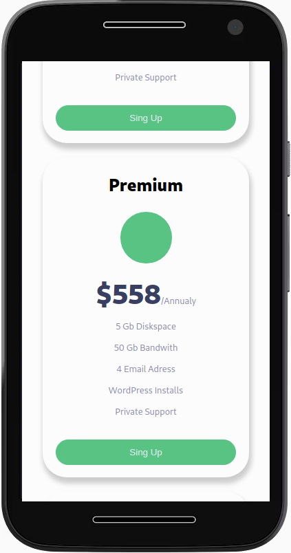

# Princing Toggle
---
### Practice styles responsibe with react


If you start the proyect, copy and paste these commands in your console.

 ```bash
 $ git clone https://github.com/Soni295/Easybank-landing-page
 $ cd Princing-Toggle
 $ yarn install
 $ yarn start 
 ```

## Desktop



## Phone

<div>


</div>

